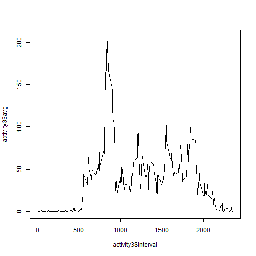
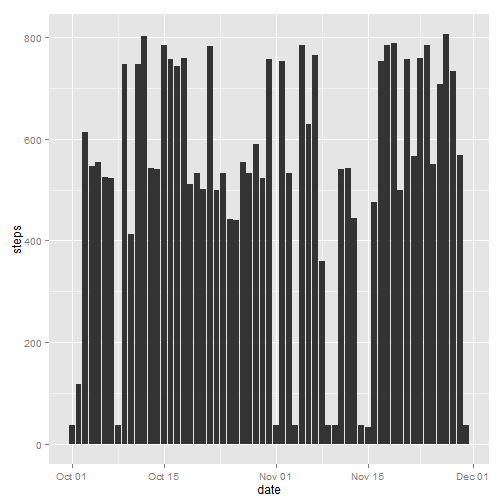
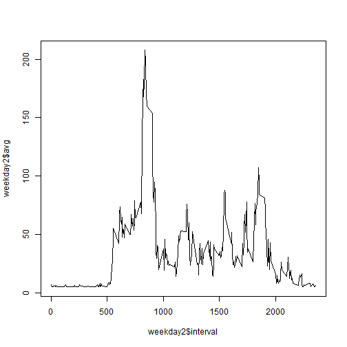
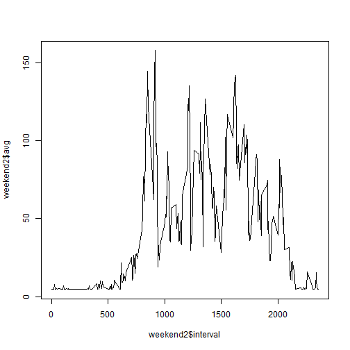

# Reproducible Research: Peer Assessment 1

## Loading and preprocessing the data
Read in the CSV file and classify columns.

```r
activity <- read.csv("activity.csv", colClasses = c("numeric","Date","numeric"))
```
## What is mean total number of steps taken per day?
1. Create a Histogram Utilizing ggplot2.  Plot total number of steps taken per day.


```r
library(ggplot2)
p <- ggplot(activity, aes(x=date, y=steps)) + geom_histogram(stat='identity', position='dodge')
datebreaks <- seq(as.Date("2012-10-01"), as.Date("2012-11-30"), by="1 week")
p 
```

 

2. Calculate and report the mean and median total number of steps taken per day


```r
library(doBy)
summaryBy(steps ~ date, data = activity, 
          FUN = list(mean, max, min, median, sd))
```

```
##          date steps.mean steps.max steps.min steps.median steps.sd
## 1  2012-10-01         NA        NA        NA           NA       NA
## 2  2012-10-02     0.4375       117         0            0    6.913
## 3  2012-10-03    39.4167       613         0            0  111.898
## 4  2012-10-04    42.0694       547         0            0  108.602
## 5  2012-10-05    46.1597       555         0            0  120.916
## 6  2012-10-06    53.5417       526         0            0  121.205
## 7  2012-10-07    38.2465       523         0            0   88.333
## 8  2012-10-08         NA        NA        NA           NA       NA
## 9  2012-10-09    44.4826       748         0            0  130.017
## 10 2012-10-10    34.3750       413         0            0   77.078
## 11 2012-10-11    35.7778       748         0            0  127.648
## 12 2012-10-12    60.3542       802         0            0  155.086
## 13 2012-10-13    43.1458       542         0            0  112.938
## 14 2012-10-14    52.4236       540         0            0  130.084
## 15 2012-10-15    35.2049       786         0            0  119.485
## 16 2012-10-16    52.3750       758         0            0  140.802
## 17 2012-10-17    46.7083       744         0            0  132.228
## 18 2012-10-18    34.9167       759         0            0  121.820
## 19 2012-10-19    41.0729       512         0            0   98.061
## 20 2012-10-20    36.0938       532         0            0  109.048
## 21 2012-10-21    30.6285       501         0            0   83.149
## 22 2012-10-22    46.7361       783         0            0  134.043
## 23 2012-10-23    30.9653       499         0            0   80.904
## 24 2012-10-24    29.0104       533         0            0   81.791
## 25 2012-10-25     8.6528       443         0            0   38.729
## 26 2012-10-26    23.5347       440         0            0   62.309
## 27 2012-10-27    35.1354       555         0            0   98.655
## 28 2012-10-28    39.7847       533         0            0   93.179
## 29 2012-10-29    17.4236       591         0            0   58.846
## 30 2012-10-30    34.0938       523         0            0   96.737
## 31 2012-10-31    53.5208       757         0            0  141.101
## 32 2012-11-01         NA        NA        NA           NA       NA
## 33 2012-11-02    36.8056       753         0            0  121.521
## 34 2012-11-03    36.7049       533         0            0   95.611
## 35 2012-11-04         NA        NA        NA           NA       NA
## 36 2012-11-05    36.2465       785         0            0  119.559
## 37 2012-11-06    28.9375       630         0            0   80.024
## 38 2012-11-07    44.7326       766         0            0  124.437
## 39 2012-11-08    11.1771       359         0            0   38.160
## 40 2012-11-09         NA        NA        NA           NA       NA
## 41 2012-11-10         NA        NA        NA           NA       NA
## 42 2012-11-11    43.7778       540         0            0  113.627
## 43 2012-11-12    37.3785       542         0            0  117.245
## 44 2012-11-13    25.4722       444         0            0   64.409
## 45 2012-11-14         NA        NA        NA           NA       NA
## 46 2012-11-15     0.1424        33         0            0    1.999
## 47 2012-11-16    18.8924       475         0            0   62.519
## 48 2012-11-17    49.7882       753         0            0  145.656
## 49 2012-11-18    52.4653       785         0            0  141.655
## 50 2012-11-19    30.6979       789         0            0  120.217
## 51 2012-11-20    15.5278       500         0            0   54.660
## 52 2012-11-21    44.3993       758         0            0  141.774
## 53 2012-11-22    70.9271       567         0            0  153.560
## 54 2012-11-23    73.5903       760         0            0  175.275
## 55 2012-11-24    50.2708       785         0            0  147.882
## 56 2012-11-25    41.0903       551         0            0   98.307
## 57 2012-11-26    38.7569       709         0            0  118.005
## 58 2012-11-27    47.3819       806         0            0  143.289
## 59 2012-11-28    35.3576       733         0            0  129.013
## 60 2012-11-29    24.4688       568         0            0   81.470
## 61 2012-11-30         NA        NA        NA           NA       NA
```

## What is the average daily activity pattern?
1. Create as Time Series plot of of the 5-minute interval (x-axis) and the average number of steps taken, averaged across all days (y-axis).


```r
library(plyr)
activity2 <- na.omit(activity)
activity3 <- ddply(activity2, c("interval"), na.rm = FALSE, summarise, avg = mean(steps))
plot(activity3$interval, activity3$avg, type="l")
```

 

2. Which 5-minute interval, on average across all the days in the dataset, contains the maximum number of steps?

A.  Maximun number of steps is:

```r
max(activity3$avg)
```

```
## [1] 206.2
```
B. The 5-minute interval with the maximun number of steps is:

```r
activity3 <- activity3[order(-activity3$avg),]
activity3[1, ]
```

```
##     interval na.rm   avg
## 104      835 FALSE 206.2
```

## Imputing missing values

1.  Calculate and report the total number of missing values in the dataset (i.e. the total number of rows with NAs)


```r
length(activity[is.na(activity)])
```

```
## [1] 2304
```

2. Devise a strategy for filling in all of the missing values in the dataset. The strategy does not need to be sophisticated. For example, you could use the mean/median for that day, or the mean for that 5-minute interval, etc.

This code chunk will replace NA's with the mean.

```r
library(plyr)
impute.med <- function(steps) replace(steps, is.na(steps), mean(steps, na.rm = TRUE))
dat2 <- sapply(activity, function(steps){
    if(is.numeric(steps)){
            impute.med(steps)
        } else {
            steps
        }
    }
)
```

This code chunk will create a data frame with replaced NA's and binds the date.

```r
library(data.table)
activity2 <- data.frame(dat2)

activity2a <- activity2[c(1, 3)]
activitya <- activity[c(2)]

activity3 <- cbind(activity2a, activitya)

p <- ggplot(activity3, aes(x=date, y=steps)) + geom_histogram(stat='identity', position='dodge')
p 
```

 

```r
library(doBy)
summaryBy(steps ~ date, data = activity3, 
          FUN = list(mean, median))
```

```
##          date steps.mean steps.median
## 1  2012-10-01    37.3826        37.38
## 2  2012-10-02     0.4375         0.00
## 3  2012-10-03    39.4167         0.00
## 4  2012-10-04    42.0694         0.00
## 5  2012-10-05    46.1597         0.00
## 6  2012-10-06    53.5417         0.00
## 7  2012-10-07    38.2465         0.00
## 8  2012-10-08    37.3826        37.38
## 9  2012-10-09    44.4826         0.00
## 10 2012-10-10    34.3750         0.00
## 11 2012-10-11    35.7778         0.00
## 12 2012-10-12    60.3542         0.00
## 13 2012-10-13    43.1458         0.00
## 14 2012-10-14    52.4236         0.00
## 15 2012-10-15    35.2049         0.00
## 16 2012-10-16    52.3750         0.00
## 17 2012-10-17    46.7083         0.00
## 18 2012-10-18    34.9167         0.00
## 19 2012-10-19    41.0729         0.00
## 20 2012-10-20    36.0938         0.00
## 21 2012-10-21    30.6285         0.00
## 22 2012-10-22    46.7361         0.00
## 23 2012-10-23    30.9653         0.00
## 24 2012-10-24    29.0104         0.00
## 25 2012-10-25     8.6528         0.00
## 26 2012-10-26    23.5347         0.00
## 27 2012-10-27    35.1354         0.00
## 28 2012-10-28    39.7847         0.00
## 29 2012-10-29    17.4236         0.00
## 30 2012-10-30    34.0938         0.00
## 31 2012-10-31    53.5208         0.00
## 32 2012-11-01    37.3826        37.38
## 33 2012-11-02    36.8056         0.00
## 34 2012-11-03    36.7049         0.00
## 35 2012-11-04    37.3826        37.38
## 36 2012-11-05    36.2465         0.00
## 37 2012-11-06    28.9375         0.00
## 38 2012-11-07    44.7326         0.00
## 39 2012-11-08    11.1771         0.00
## 40 2012-11-09    37.3826        37.38
## 41 2012-11-10    37.3826        37.38
## 42 2012-11-11    43.7778         0.00
## 43 2012-11-12    37.3785         0.00
## 44 2012-11-13    25.4722         0.00
## 45 2012-11-14    37.3826        37.38
## 46 2012-11-15     0.1424         0.00
## 47 2012-11-16    18.8924         0.00
## 48 2012-11-17    49.7882         0.00
## 49 2012-11-18    52.4653         0.00
## 50 2012-11-19    30.6979         0.00
## 51 2012-11-20    15.5278         0.00
## 52 2012-11-21    44.3993         0.00
## 53 2012-11-22    70.9271         0.00
## 54 2012-11-23    73.5903         0.00
## 55 2012-11-24    50.2708         0.00
## 56 2012-11-25    41.0903         0.00
## 57 2012-11-26    38.7569         0.00
## 58 2012-11-27    47.3819         0.00
## 59 2012-11-28    35.3576         0.00
## 60 2012-11-29    24.4688         0.00
## 61 2012-11-30    37.3826        37.38
```
## Are there differences in activity patterns between weekdays and weekends?


```r
activity3$day <- weekdays(activity3$date)

activity3 = within(activity3,
{
        Week = as.factor( 
                ifelse(
                        (activity3$day) 
                        %in% c("Saturday","Sunday") 
                , "weekend", "weekday"
        )
)
}
)
```

Subset the data into two data frames.  One for weekends and one for weekdays.


```r
weekend <- subset(activity3, day=="Saturday" | day=="Sunday")
weekday <- subset(activity3, day=="Monday" | day=="Tuesday" | day=="Wednesday" | day=="Thursday" | day == "Friday")
```

Plot the weekend and weekday data frames for comparison.


```r
library(plyr)

weekday2 <- ddply(weekday, c("interval"), na.rm = FALSE, summarise, avg = mean(steps))
plot(weekday2$interval, weekday2$avg, type="l")
```

 

```r
weekend2 <- ddply(weekend, c("interval"), na.rm = FALSE, summarise, avg = mean(steps))
plot(weekend2$interval, weekend2$avg, type="l")
```

 
